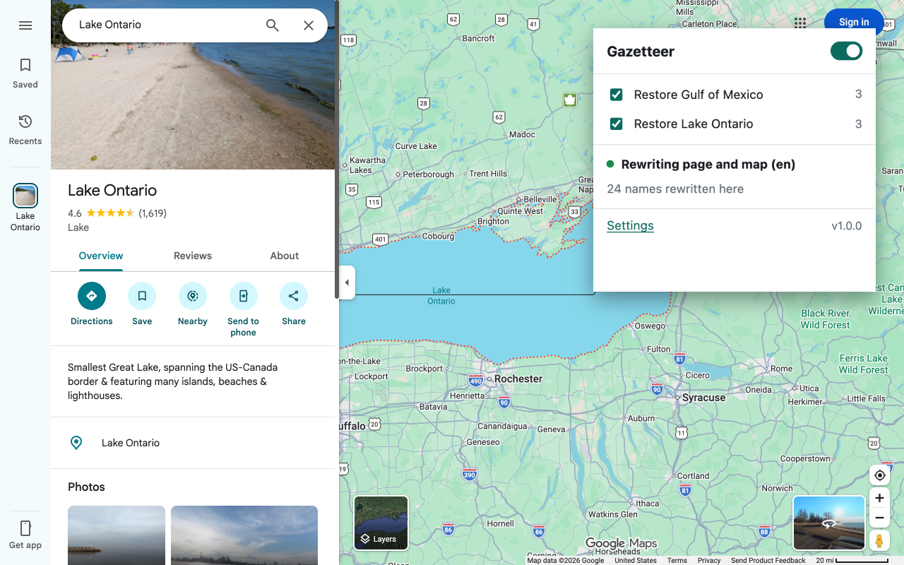

<p align="center">
  
</p>

<h1 align="center">Gazetteer</h1>

<p align="center">A Chrome extension that lets you decide what Google Maps calls things.</p>

<p align="center">
  <a href="https://github.com/donth77/gazetteer-maps-rename-extension/actions/workflows/ci.yml"></a>
  <a href="https://github.com/donth77/gazetteer-maps-rename-extension/actions/workflows/daily-health.yml"></a>
  
  <a href="LICENSE"></a>
</p>

---

Google renamed the Gulf of Mexico and Lake Ontario. This puts the proper names
back, or any name you want, on anything from countries to corner stores.

Renames show up everywhere: the sidebar, search results, the tab title, and the
labels drawn on the map itself. Display only. No network requests, no tracking.
Names are settings, not code.

<p align="center">
  
</p>

## Install

```sh
pnpm install
pnpm run build
```

Open `chrome://extensions`, turn on Developer mode, click "Load unpacked", pick
`dist/`. Reload any open Maps tabs. Or run `pnpm run demo` to try it in a
throwaway browser first.

## Usage

The popup switches each place on or off. Settings is the full editor, with
import and export, and a rename can apply in one language or in all of them.

Names have to match exactly, capitals included, so a state needs both "Florida" and "FLORIDA". And where a label wraps onto two lines, only one of the words can change. Places that share a name cannot be told apart on the map, because a label arrives as the bare word: "Paris, France" renames the sidebar and leaves the map alone, while "Paris" renames every Paris there is.

## How it works

For page text, an observer rewrites the names before the browser
paints them.

For map labels, Google draws them with WebGL inside web workers and there's no text on the page to edit. The names pass through a browser
function and that is where the extension steps in.

While the map loads, Google shows prerendered images that still carry the old
names. The extension hides those behind a copy of the Maps loading grid by default.

## Develop

```sh
pnpm run check     # typecheck and unit tests; gates merges
pnpm run verify    # drives real Google Maps; never gates anything
pnpm run package   # release build, zipped for the Chrome Web Store
pnpm run watch     # rebuild on change
```

`verify` needs a Chrome for Testing build, found automatically in the
Playwright cache. Dev builds show a build timestamp in the popup so you know
Chrome picked up your rebuild. `RELEASE=1 pnpm run build` leaves it out.

`ci` runs tests and the build on every push. `daily-health` runs once a day and
fails only if the extension stops rewriting live Maps. It also watches the
federal names database and warns when an official name changes, which means:
update `data/names.json` soon, because Google ships the change within days.

## Permissions and privacy

`storage`, plus Google Maps addresses. Nothing else. Your rules stay on your
computer and the extension makes no network requests. See [PRIVACY.md](PRIVACY.md).

Place names live in `data/names.json`.
